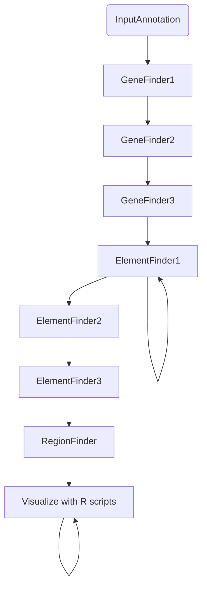
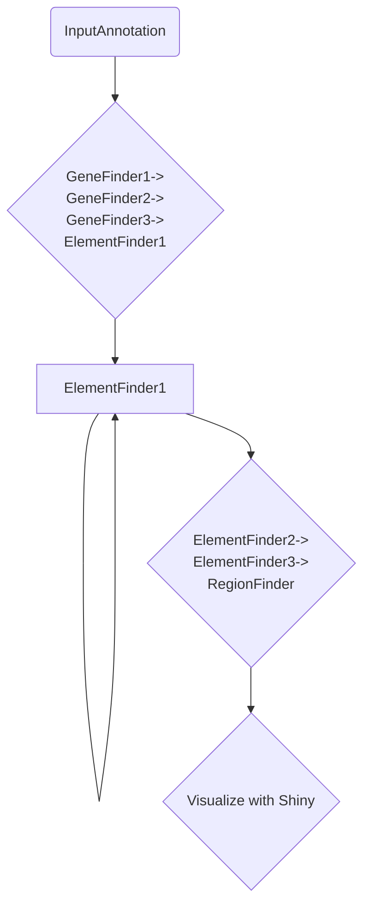

# Starfish Discovery


*aka ilikebigmobileelementsandicannotlie*

## Group members

Jonah Cullen, Callum MacPhillamy, Mauricio Moldes, Alexis Norris, Meghana Ram, Marcus Chan, and Russel Santos


## Introduction

Mobile genetic elements (also known as transposons or jumping genes) can jump  to different locations of a genome by either a cut-and-paste mechanism or a copy-and-paste mechanism. Transposons can help genomes evolve, have mutagenic effects and  affect gene expression across species. In humans, they are implicated in the origin of diseases (Chenais.Transposable Elements and Human Diseases: Mechanisms and Implication in the Response to Environmental Pollutants.). On the flip side, they can be used in genetic engineering to cure genetic diseases, making their discovery and annotation in the genome important. 

In fungi, transposons confer metal resistance and have a significant impact in genome evolution. However, identifying and annotating them in the genome can be challenging due to their diverse structures, which complicate mapping, and their ability to transfer between species, making it difficult to determine their function.

Starfish ([Gluck-Thaler and Vogen. Systematic identification of cargo-mobilizing genetic elements reveals new dimensions of eukaryotic diversity. Nucleic Acids Research 2024.](https://doi.org/10.1093/nar/gkae327)) is a recently developed tool for *de novo* giant mobile element discovery/annotation in fungal genomes. This project aims to improve the usability of [starfish (v1.0.0)](https://github.com/egluckthaler/starfish).


## Methods

**Containerization of current pipeline:** The current Starship pipeline consists of individual bash scripts, and the conda environment provided poses difficulty when running on different operating systems. A docker container is created to ensure easy execution across operating systems and to ensure reproducibility.

**Streamlining the current pipeline:**  The pipeline is streamlined on snakemake to create an easier and a modular workflow. This makes the pipeline more efficient and robust.

**Starfish discovery application:** The Starfish Discovery application visualizes the downstream analyses of Starfish through a R Shiny app to provide an interactive experience.


### Original implementation



### Our streamlined implementation



## Deliverables

1. Docker workflow for `starfish`  
2. Snakemake pipeline for `starfish`       
3. R Shiny app for vizualization of `starfish` output


## Status

### 1. Docker to run `starfish` (Callum)

I ran into various issues getting the pipeline to work on a Mac so I went
straight to making a Docker image. 

You should be able to test it with the following steps:

```bash
# Clone repository
git clone https://github.com/collaborativebioinformatics/ilikebigmobileelementsandicannotlie

# cd into the project repo
cd ilikebigmobileelementsandicannotlie

# Make a new directory for the results to be stored.
mkdir docker_example

# Run the container. 
## Please excuse the personal dockerhub repo. I can move it to a more official one.
docker run -it -v $(pwd)/docker_example:/tmp/starfish_example_output/ callumm93/starfish:v1.0.0

# Inside the container, run the example script.
bash run_starfish_example.sh
```
This should go through the tutorial example and produce some output.

To run `starfish` with new data, use the following:

```bash

# cd to the directory with the data
cd /path/to/your/new/data

docker run -it -v $(pwd):/opt/data --platform linux/amd64 callumm93/starfish:v1.0.0

# The container will put you inside `/opt/starfish/`.
cd ../
ls -1 # You should see data/ here. Inside data/ you should have your new data.
```

### 2. Snakemake

Jonah: In progress.


### 3. R Shiny app

Meghana & Russel & Alexis: In progress. Parameterized original R code; testing with Callum's docker example output files.

## Conclusion and next steps

The `snakemake` implementation streamlines the modular `starfish` code to improve the usability of the tool  and enable the identification and annotation of mobile genetic elements. A docker container has been created for enhanced scalability and reproducibility. These transposons are visualized with their genomic context using a R Shiny application. Future goals could include the application of `starfish` to non-fungal genomes (particularly, mammalian). However, there are anticipated challenges of acquiring the appropriate annotation input files and computational time when moving from small fungal to large mammalian genomes.An alternative approach could involve using different computational tools to identify transposons in eukaryotic organisms. By employing multiple methods, you can derive a consensus, which may enhance the accuracy and reliability of identifying mobile genetic elements.


