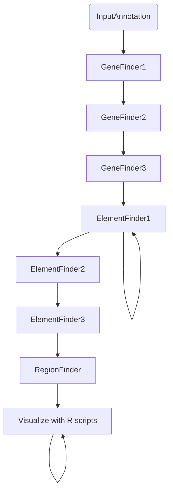
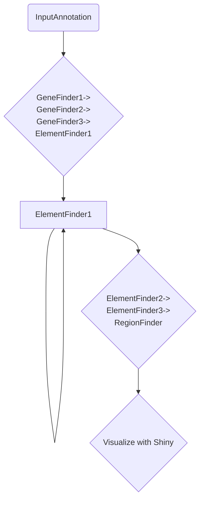

# Starfish Discovery

(previously: ilikebigmobileelementsandicannotlie)


## Group members

Jonah Cullen, Callum MacPhillamy, Mauricio Moldes, Alexis Norris, Meghana Ram, Marcus Chan, and Russel Santos


## Scope of this project

This project aims to improve the usability of [starfish](https://github.com/egluckthaler/starfish). Starfish ([Gluck-Thaler and Vogen. Systematic identification of cargo-mobilizing genetic elements reveals new dimensions of eukaryotic diversity. Nucleic Acids Research 2024.](https://doi.org/10.1093/nar/gkae327)) is a tool for *de novo* giant mobile element discovery/annotation in fungal genomes. Starfish currently requires running multiple, separate bash scripts. We aim to create pipelines/workflows for a more accessible, streamlined, and user-friendly implementation of starfish that could expand its use. Downstream analysis currently involves `R` scripts on [figshare](https://figshare.com/articles/dataset/Supporting_data_for_Systematic_identification_of_cargo-carrying_genetic_elements_reveals_new_dimensions_of_eukaryotic_diversity_/24430447). We aim to improve accessibility of these scripts through implementation in an `R` Shiny app.

### Current implementation



### Our goal



### Future goals
Future goals could include the application of Starfish to non-fungal genomes (particularly, mammalian). However, there are anticipated challenges of acquiring the appropriate annotation input files and computational time when moving from small fungal to large mammalian genomes.


## Deliverables

1. Snakemake pipeline for `starfish` (Jonah)  
2. DNAnexus app for `starfish` (Alexis) 
3. Docker workflow for `starfish` (Callum) 
4. R Shiny app for vizualization of `starfish` output (Meghana, Russel)


## Running `starfish` with Docker

I ran into various issues getting the pipeline to work on a Mac so I went
straight to making a Docker image. 

You should be able to test it with the following steps:

```bash
# cd into the project repo
cd ilikebigmobileelementsandicannotlie

# Make a new directory for the results to be stored.
mkdir docker_example

# Run the container. 
## Please excuse the personal dockerhub repo. I can move it to a more official one.
docker run -it -v $(pwd)/docker_example:/tmp/starfish_example_output/ callumm93/starfish:v1.0.0

# Inside the container, run the example script.
bash run_starfish_example.sh
```
This should go through the tutorial example and produce some output.

To run `starfish` with new data, use the following:

```bash

# cd to the directory with the data
cd /path/to/your/new/data

docker run -it -v $(pwd):/opt/data --platform linux/amd64 callumm93/starfish:v1.0.0

# The container will put you inside `/opt/starfish/`.
cd ../
ls -1 # You should see data/ here. Inside data/ you should have your new data.
```
